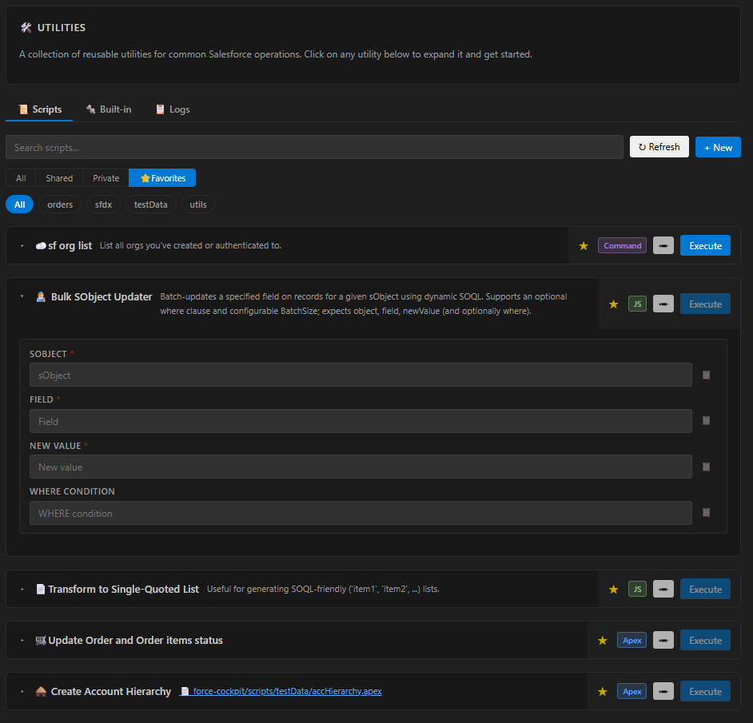
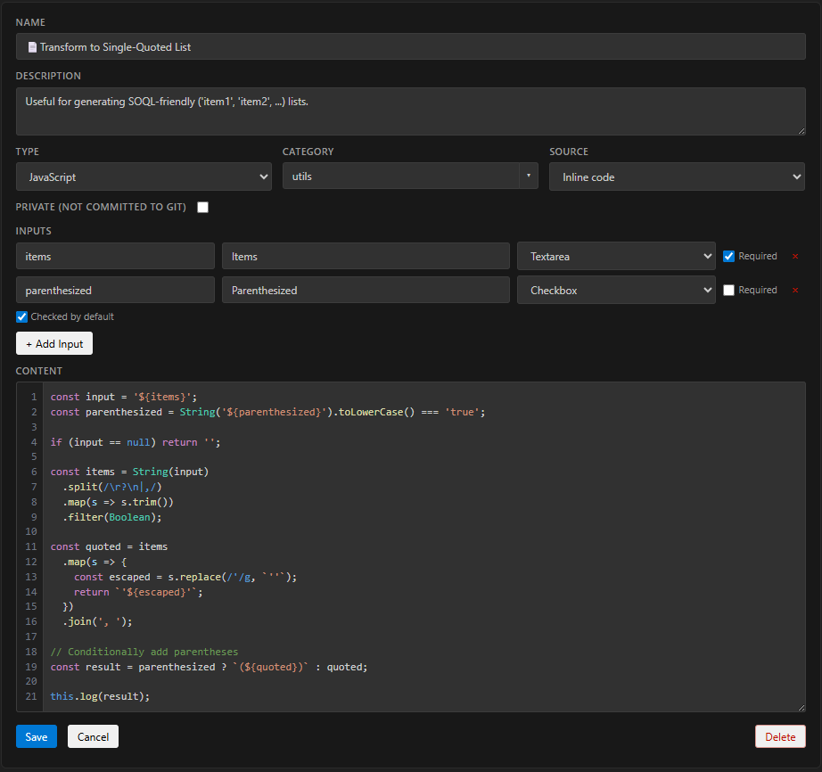
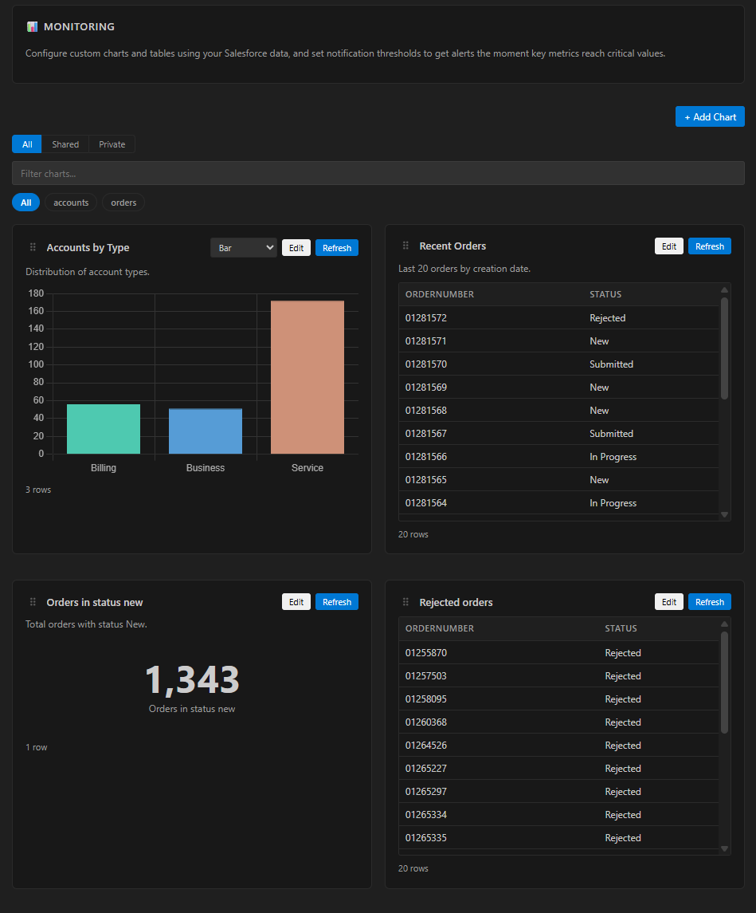

# Force Cockpit

[](https://marketplace.visualstudio.com/items?itemName=noriabits.force-cockpit)
[](https://marketplace.visualstudio.com/items?itemName=noriabits.force-cockpit)
[](https://marketplace.visualstudio.com/items?itemName=noriabits.force-cockpit)
[](https://github.com/noriabits/force-cockpit/actions/workflows/release.yml)
[](https://github.com/noriabits/force-cockpit/blob/main/LICENSE)

A VSCode extension that provides a Salesforce utilities cockpit. It connects to Salesforce orgs via the SF CLI and offers operational tools for monitoring and general utilities — all from within VSCode. Contact: Pablo Fernández Posadas [@paferpo](https://github.com/paferpo)

---

## Installation

### From the VS Code Marketplace

1. Open the Extensions panel (`Ctrl+Shift+X` / `Cmd+Shift+X`).
2. Search for **Force Cockpit**.
3. Click **Install**.

### From a `.vsix` file

1. Download the latest `.vsix` file from the [releases](https://github.com/noriabits/force-cockpit/releases).
2. In VSCode, open the Extensions panel.
3. Click the `...` menu → **Install from VSIX...** and select the file.

Alternatively, install from the terminal:

```bash
code --install-extension force-cockpit-<version>.vsix
```

### Prerequisites

- [Salesforce CLI (`sf`)](https://developer.salesforce.com/tools/salesforcecli) must be installed and on your `PATH`.
- You must be authenticated to at least one Salesforce org (`sf org login web`).

---

## Getting Started

1. Open a workspace that contains an SFDX project (or any folder).
2. Use the **Salesforce** extension to set your default org (`SFDX: Set a Default Org` command, or click the org name in the status bar).
3. Force Cockpit auto-connects to the `target-org` set in `.sf/config.json` at startup — and reconnects automatically whenever you switch orgs via the Salesforce extension.
4. Open the cockpit panel via the Command Palette: **Force Cockpit: Open Cockpit**.

If you switch orgs while an operation is in progress, a confirmation dialog appears. Confirming cancels any running operations and connects to the new org.

If the panel doesn't pick up an org change automatically (e.g. the file watcher missed an event, or the SF CLI hasn't finished writing the new credentials), click the 🔄 button next to the connection status in the panel header to force a fresh re-read of `.sf/config.json` and a reconnect. The same 🔄 Refresh action also appears inside the "No org connected" card.

---

## Tabs

| Tab | Description |
|-----|-------------|
| **Overview** | Org info card, storage usage bars, SOQL Quick Query editor (tabs, history, autocomplete, Tooling toggle) with a filterable, sortable results table |
| **Utils** | Built-in utilities (Clone User, Reactivate OmniScript) and custom YAML scripts |
| **Monitoring** | SOQL-powered Chart.js dashboards loaded from YAML config files |

---

## Overview Tab

The Overview tab shows org connection details and storage usage bars (Data Storage and File Storage), and provides a SOQL Quick Query editor (run with **Run Query** or `Cmd`/`Ctrl`+`Enter`).

The editor supports:

- **Query tabs** — keep several queries open at once. Use **+** to add a tab, double-click a tab to rename it, and **×** to close it. New tabs start pre-filled with `SELECT Id FROM ` (cursor ready for the object name). Tab names and queries are saved per workspace and restored when you reopen the panel (results are not persisted).
- **History** — every query you run is recorded under **History ▾ → Recent** (newest first, deduped). Click **★ Save** to store the current query under a name (**History ▾ → Saved**); pick any entry to load it into the active tab.
- **SOQL autocomplete** — as you type, suggestions appear for sObjects (after `FROM`), fields and relationships (in `SELECT` / `WHERE` / `ORDER BY` / `GROUP BY`, including dotted traversal like `Account.Owner.Name`), and picklist values inside `WHERE … = '…'`. Press `Ctrl`/`Cmd`+`Space` to force suggestions; `↑`/`↓` to move, `Enter`/`Tab` to insert, `Esc` to dismiss.
- **Tooling API** — tick **Tooling API** to run the query against the Tooling API (e.g. `ApexClass`, `Flow`).

The results table supports:

- **Filter** — type in the filter box above the table to narrow rows by a case-insensitive match across all columns; a counter shows how many of the total rows match.
- **Sort** — click any column header to sort; click again to reverse.
- **Copy column as IN-list** — click the **⧉** button on a column header to copy that column's values (deduped, as `'a', 'b', 'c'`) to the clipboard, ready to paste into another query's `IN (…)` clause. Respects the current filter.
- **Open records** — any Salesforce record Id in a cell renders as a link that opens the record in your browser.
- **Record counts** — `SELECT COUNT() FROM …` queries show the count instead of "0 records".
- **Export** — **Export CSV** / **Export JSON** writes the current (filtered and sorted) view to a timestamped `query-result-…` file in your workspace root and opens it in the editor.

---

## Utils Tab — YAML Scripts

<div align="center"></div>

> Scripts can also be created and edited directly in the UI — no need to write YAML by hand.
<div align="center"></div>

The **Scripts** sub-tab executes scripts defined in YAML files. Four script types are supported (Apex, Command, JavaScript, and **AI** — see [AI scripts](#ai-scripts)). Scripts live under `force-cockpit/scripts/{category}/*.yaml` (shared) or `force-cockpit/private/scripts/{category}/*.yaml` (private, git-ignored). Sub-categories are also supported: `{category}/{sub-category}/*.yaml` gives a second row of pills for drilling down.
> [!TIP]
> **Repository examples:** Ready-to-use YAML script examples are available under `force-cockpit/scripts/examples/`.

```yaml
# Apex script — requires org connection
name: My Apex Script
description: What this script does.
apex: |
  System.debug('Hello from Apex');

# Terminal command — no org connection required
name: My Command
description: Runs a local shell command.
command: npm run build

# JavaScript script — runs in Node.js VM sandbox, org connection is optional
name: My JS Script
description: Query Salesforce with jsforce.
js: |
  const result = await query("SELECT Id, Name FROM Account LIMIT 5");
  log(JSON.stringify(result.records, null, 2));
```

Exactly one of `apex:`, `command:`, `js:`, or `ai:` is required. Click **Execute** on any script card to run it.

### Configurable Inputs

Scripts can declare input variables that are prompted at execution time. Add an `inputs:` section to your YAML:

```yaml
name: Update Order Status
description: Updates an order and its line items.
inputs:
  - name: orderId
    label: Order ID
    required: true
  - name: status
    label: Status
    type: picklist
    required: true
    options:
      - New
      - Submitted
      - Completed
      - Cancelled
      - In Progress
apex: |
  Id orderId = '${orderId}';
  // ... use orderId and status in your Apex code
```

Each input supports:
| Field | Required | Description |
|-------|----------|-------------|
| `name` | Yes | Variable identifier (alphanumeric + underscore) — used as `${name}` in the script body |
| `label` | No | Display label (defaults to `name`) |
| `type` | No | `string` (text input, default) or `picklist` (dropdown) |
| `required` | No | If `true`, Execute is disabled until the field is filled |
| `options` | Picklist only | List of selectable values |

Write `${variableName}` in your script code where you want the value substituted. Escaping is handled automatically (Apex-safe for `apex`, JSON-safe for `js`, raw for `command`).

### System Placeholders

In addition to user-defined inputs, scripts can use built-in system placeholders that are automatically resolved from the connected org:

| Placeholder | Description |
|-------------|-------------|
| `${orgUsername}` | Salesforce username (not alias) of the connected org |

System placeholders use the same `${name}` syntax and type-appropriate escaping as user inputs. If no org is connected, they resolve to an empty string. If a user-defined input has the same name as a system placeholder, the user input takes precedence.

```yaml
name: Show My User
apex: |
  System.debug('Running as: ${orgUsername}');
```

| Type | Badge | Org required | Output |
|------|-------|-------------|--------|
| Apex | Blue | Yes | Debug log (USER_DEBUG filter available) |
| Command | Purple | No | stdout/stderr |
| JavaScript | Green | No | `log()` / `console.log()` output |
| AI | Orange | Yes | Streamed model analysis |

**JS script context**: `connection` (jsforce Connection or null), `org` (OrgDetails or null), `query(soql)`, `log()`, `error()`, `console`, `fs`, `path`, `yaml`.

### AI scripts

An **AI script** optionally gathers Salesforce data with a *fixed, author-defined* step and then uses a language model (via VS Code's built-in [Language Model API](https://code.visualstudio.com/api/extension-guides/ai/language-model), powered by GitHub Copilot) to **analyse** it. The analysis streams into the script's output. The gather step is optional — omit it (uncheck "Gather data first" in the form) for a script driven purely by its prompt + inputs.

**Requirements:** GitHub Copilot must be enabled in VS Code (the first run shows a one-time consent prompt), and an org must be connected.

```yaml
name: Energy account analysis
description: Summarises energy-industry accounts.
model: auto                         # the chosen model's id — the form requires one and defaults to Copilot's "Auto"
inputs:
  - name: industry
    label: Industry
    required: true
gather:                             # OPTIONAL fixed data step — exactly one of soql / apex / apex-file (omit for a prompt-only script)
  soql: SELECT Id, Name, AnnualRevenue FROM Account WHERE Industry = '${industry}'
ai: |                               # the analysis prompt (use ai-file: to load it from a file)
  Summarise the accounts below and flag anything unusual about their revenue.
allow-followup-queries: true        # optional — lets the model run follow-up SOQL for extra context
allow-read-workspace-files: true    # optional — lets the model search & read workspace files (any non-gitignored source/metadata)
skills:                             # optional — ids of skills the model may read on demand
  - data-quality-checklist
```

How it works and why it's safe:

- **You control the data step.** The `gather` SOQL/Apex is yours and runs exactly as written — the model never writes or chooses Apex, so there is **no risk of it modifying data**.
- **The model only analyses.** It receives the gathered data + your prompt and replies with text.
- **Optional follow-up queries.** With `allow-followup-queries: true`, the model may run additional **SOQL** queries (`SELECT` only) to pull more context. It can never run anything that writes.
- **Optional workspace file access.** With `allow-read-workspace-files: true`, the model can **search** workspace files by name (a case-insensitive regular expression — a plain word like `Selector` matches `OrderSelector`, `AccountSelector`) and **read** any matching source/metadata file (Apex, objects, fields, flows, LWC, permission sets…). Handy for diagnosing stack traces across your metadata. Anything excluded by your `.gitignore` (e.g. `force-cockpit/private/`) is never listed or read.
- **Model picker.** Picking a model is **required** (the field is marked with a red `*`). The list is populated from the models Copilot offers — de-duplicated and sorted alphabetically — and **defaults to Copilot's "Auto"** model when it's available. If a script's saved model is no longer available at run time, Force Cockpit falls back to **Auto** (or the first available model), prepends a warning to the output, and shows a notification — so the run still completes. Note: some models don't support follow-up queries — gather + analyse still works regardless.
- **Skills (reusable playbooks).** Tick **Skills** in the form to attach [Agent Skills](https://code.visualstudio.com/api) — markdown guides stored as `{skill-id}/SKILL.md` under `.claude/skills` or `.github/skills` in your workspace. The model sees a short catalogue (id + description) of the attached skills and can pull a skill's full content on demand via a tool; nothing is auto-injected. Override the scanned folders with `skillsPaths` in `force-cockpit/config.yaml`.
- **Schema is cached locally.** Before querying, the model checks object fields via a `describe_object` tool. Results are cached per workspace under `force-cockpit/.describe-cache/` (git-ignored, 2-week expiry) and shared with the Overview Quick Query autocomplete, so repeated lookups don't hit the org. Click the 🔄 refresh button next to the connection status to clear the cache and re-pull the latest schema.
- **Open as markdown.** AI analysis is written in Markdown. Once a run finishes, an **Open as markdown** button (next to *Open in editor* / *Copy to clipboard*) opens the output in VSCode's built-in Markdown preview — headings, lists, tables, and code blocks rendered nicely. Nothing is written to disk; it opens an in-memory untitled document. The gathered data is shown as a code block in the preview.

`${input}` and `${orgUsername}` placeholders work in both the prompt and the gather step.

### Private scripts

Check **Private** when creating or editing a script to save it to `force-cockpit/private/scripts/` instead of the shared folder. The extension automatically adds `force-cockpit/private/` to `.gitignore` on startup. Private scripts show a 🔒 badge and can be filtered with the **All / Shared / Private** control. You cannot save a private script with the same category + name as an existing shared one.

---

## Monitoring Tab

<div align="center"></div>

The Monitoring tab displays live charts built from SOQL queries. Each chart is defined by a YAML configuration file. Charts are rendered using [Chart.js](https://www.chartjs.org/) and can be refreshed manually or on a timer.

### Where charts come from

Charts are loaded from two sources (merged at runtime, later wins):

| Source | Path | Purpose |
|--------|------|---------|
| **User-defined** | `{workspace}/force-cockpit/monitoring/{category}/*.yaml` | Your own charts, committed to git |
| **Private** | `{workspace}/force-cockpit/private/monitoring/{category}/*.yaml` | Personal charts, **not** committed to git |

The user-defined path can be customised via the VSCode setting `forceCockpit.cockpitPath` (see [Configuration](#configuration)).

### Private charts

Checking **Private** in the chart edit form saves the config to `force-cockpit/private/monitoring/` instead of the shared folder. The extension automatically adds `force-cockpit/private/` to `.gitignore` on startup so these files are never committed.

Private charts show a 🔒 badge on their card. Use the **All / Shared / Private** filter above the category pills to show only the configs you care about.

You cannot save a private chart with the same category + name as an existing shared one (and vice versa) — the extension will show an error.

### Sub-categories

Monitoring configs support two levels of nesting: `{category}/{sub-category}/*.yaml`. Clicking a parent category pill reveals a second row of narrower sub-pills to drill down.

### Adding a new monitoring chart

1. **Pick or create a category folder** under `force-cockpit/monitoring/` in your workspace:

   ```
   {workspace}/
   └── force-cockpit/
       └── monitoring/
           └── orders/          ← any name you like
               └── my-chart.yaml
   ```

2. **Create the YAML file** using the schema below.

3. **Reload the Monitoring tab** — your chart appears automatically. No rebuild or restart needed.

### Deleting a chart

Click **Edit** on the card → click the red **Delete** button in the form → confirm in the modal. User and private charts are removed from disk. Built-in (bundled) charts cannot be deleted from disk, so they are hidden in your workspace instead — a "Restore hidden built-ins (N)" link appears in the top toolbar so you can bring them back.

### YAML schema

```yaml
name: Open Orders by Status          # Display name shown on the card
description: Count of open orders grouped by status.  # Subtitle shown on the card

soql: |
  SELECT Status, COUNT(Id) RecordCount
  FROM Order
  WHERE Status != 'Cancelled'
  GROUP BY Status

labelField: Status        # API name of the field used as chart labels (X-axis or pie slices)

valueFields:              # One or more datasets to plot
  - field: RecordCount    # API name of the numeric field
    label: Orders         # Legend label for this dataset
    format: number        # optional: number | currency | percent

chartType: bar            # bar | line | pie | doughnut | metric | table
stacked: false            # true = stacked bars/lines (bar and line only)
notifyOnIncrease: false   # true = fire a notification when totalRows grows between two refreshes
refreshInterval: 0        # Auto-refresh in seconds. 0 = manual refresh only
```

### Field reference

| Field | Required | Values | Description |
|-------|----------|--------|-------------|
| `name` | Yes | string | Card title |
| `description` | No | string | Card subtitle |
| `soql` | Yes | SOQL string | Any valid SOQL query |
| `labelField` | Yes* | API name | Field whose values become chart labels or the first table column. *Not required for `metric` type. |
| `valueFields` | Yes | array | At least one `{ field, label }` entry |
| `valueFields[].field` | Yes | API name | Field to plot or display |
| `valueFields[].label` | Yes | string | Dataset legend label or column header |
| `valueFields[].format` | No | `currency` \| `percent` | Number formatting on axes, tooltips, and table cells |
| `chartType` | No | `bar` \| `line` \| `pie` \| `doughnut` \| `metric` \| `table` | Default chart type (user can override for chart types) |
| `stacked` | No | `true` \| `false` | Stack bars or lines (bar and line only) |
| `notifyOnIncrease` | No | `true` \| `false` | Fire a VSCode warning whenever the row count grows between two auto-refreshes (e.g. new error records appearing). Snoozable for 1 hour or for the day. |
| `refreshInterval` | No | integer (seconds) | `0` disables auto-refresh |

> **Background notifications:** Charts with thresholds or `notifyOnIncrease: true` keep auto-refreshing in the background even when the Force Cockpit panel is closed, so threshold breaches and row-count growth alerts still fire. Row-count growth also plays a short OS audio cue (best-effort, uses the system audio command for your platform). Charts without these flags only refresh while the panel is open. Disconnect from the org and the background polling stops.

### Multiple datasets (grouped charts)

You can plot multiple fields from the same query side by side:

```yaml
name: Order Amounts by Status
soql: |
  SELECT Status, SUM(TotalAmount) Total, COUNT(Id) Count
  FROM Order
  GROUP BY Status
labelField: Status
valueFields:
  - field: Total
    label: Total Amount (€)
    format: currency
  - field: Count
    label: Number of Orders
chartType: bar
refreshInterval: 60
```

### Stacked bars

Add `stacked: true` to a `bar` or `line` chart with multiple `valueFields` to render them as stacked segments:

```yaml
name: Revenue by Category
soql: SELECT Name, Hardware__c, Software__c, Services__c FROM Account__c
labelField: Name
valueFields:
  - field: Hardware__c
    label: Hardware
    format: currency
  - field: Software__c
    label: Software
    format: currency
  - field: Services__c
    label: Services
    format: currency
chartType: bar
stacked: true
```

### Metric cards (KPI)

Use `chartType: metric` to display a single large number. `labelField` is not required. The first value of the first `valueField` is shown as the headline number:

```yaml
name: Open Orders
description: Total orders waiting to be processed.
soql: SELECT COUNT(Id) Cnt FROM Order WHERE Status = 'Open'
valueFields:
  - field: Cnt
    label: Open Orders
chartType: metric
refreshInterval: 30
```

### Table view

Use `chartType: table` to render a scrollable, sortable table. Works with any SOQL — aggregate or not. Click any column header to sort. Use `format: currency` or `format: percent` on valueFields to format numeric columns.

Each table card has a search box above the table that filters its rows in real time by any field (case-insensitive substring match across every column). A small counter next to the input shows `X of Y` so you can see how aggressive your filter is. The filter text persists across auto-refresh of the same card.

Any cell whose value is an 18-character Salesforce record Id (validated via the standard Salesforce case-safe checksum) is rendered as a clickable link that opens the record in your browser — no extra configuration needed. This works for `Id`, `OwnerId`, `AccountId`, and any other lookup or aliased Id column. 15-character Ids pasted into custom text fields are not auto-linked, since they have no checksum to verify and would risk false positives on plain text values.

```yaml
name: Recent Orders
description: Last 20 orders by creation date.
soql: |-
  SELECT OrderNumber, Status, TotalAmount
  FROM Order
  ORDER BY CreatedDate DESC
  LIMIT 20
labelField: OrderNumber
valueFields:
  - field: Status
    label: Status
  - field: TotalAmount
    label: Amount (€)
    format: currency
chartType: table
```

### Examples

> [!TIP]
> **Repository examples:** There are example charts in this repository under `force-cockpit/monitoring/examples/`.

### Editing and saving charts in the UI

Each card has an **Edit** button that opens an inline form. Changes to the SOQL field trigger an auto-preview after 800 ms. Check **Private** to save to the private folder; leave unchecked to save to the shared workspace path. Clicking **Save** writes the YAML — it never overwrites bundled extension charts.

---

## Configuration

Most extension settings are managed via a `config.yaml` file — making them easy to share across a team by committing the file to git.

The extension loads configuration in this order (later layers override earlier ones):
1. **Hardcoded defaults** — built into the extension
2. **Bundled `config.yaml`** — shipped with the extension at its root
3. **User `config.yaml`** — at `force-cockpit/config.yaml` in your workspace (or the custom `cockpitPath`)

Only keys present in a layer override the previous layer — omitted keys keep their default values.

### Available settings

| Key | Type | Default | Description |
|-----|------|---------|-------------|
| `apiVersion` | string | `"66.0"` | Salesforce API version for all API calls |
| `protectedSandboxes` | string[] | `[]` | Sandbox org names that require confirmation before destructive actions |
| `skillsPaths` | string[] | `[".claude/skills", ".github/skills"]` | Workspace-relative folders scanned for Agent Skills attachable to AI scripts |

### Example `force-cockpit/config.yaml`

```yaml
apiVersion: "66.0"
protectedSandboxes:
  - staging
  - uat
skillsPaths:
  - .claude/skills
  - .github/skills
```

### VSCode setting

One setting remains in VSCode's `settings.json` because it determines where the config file lives:

| Setting | Default | Description |
|---------|---------|-------------|
| `forceCockpit.cockpitPath` | `""` | Absolute path to the `force-cockpit` folder. Defaults to `{workspace root}/force-cockpit` if empty. |

> **Note:** Changes to `config.yaml` are picked up automatically — no window reload needed.

---

## Releases

New versions are published automatically via GitHub Actions.

To create a release:

1. Go to the **Actions** tab in the GitHub repository.
2. Select **Release** → **Run workflow**.
3. Choose the version bump type (`patch`, `minor`, or `major`) or enter an explicit version string.
4. Click **Run workflow**.

The workflow will:
- Bump the version in `package.json`
- Update `CHANGELOG.md` with the version and date
- Push a version commit and git tag to `main`
- Build and package the `.vsix`
- Create a **GitHub Release** with the `.vsix` attached
- Publish the extension to the **VS Code Marketplace**

The `.vsix` for every release is available on the [GitHub Releases page](https://github.com/noriabits/force-cockpit/releases).

---

## Development

```bash
npm install
npm run build       # Build extension (copy assets + esbuild bundle)
npm run watch       # Build in watch mode
npm run compile     # TypeScript type-check only
npm run package     # Build + create .vsix
npm run audit:prod  # Check production dependencies for known vulnerabilities
```

---

## Security

- **Dependency auditing**: Every PR runs `npm audit` against production dependencies in CI. [Dependabot](https://docs.github.com/en/code-security/dependabot) opens weekly PRs when vulnerable packages have updates available.
- **`.npmrc` hardening**: `audit-level=high`, `engine-strict=true`, and `save-exact=true` ensure safe and reproducible installs.