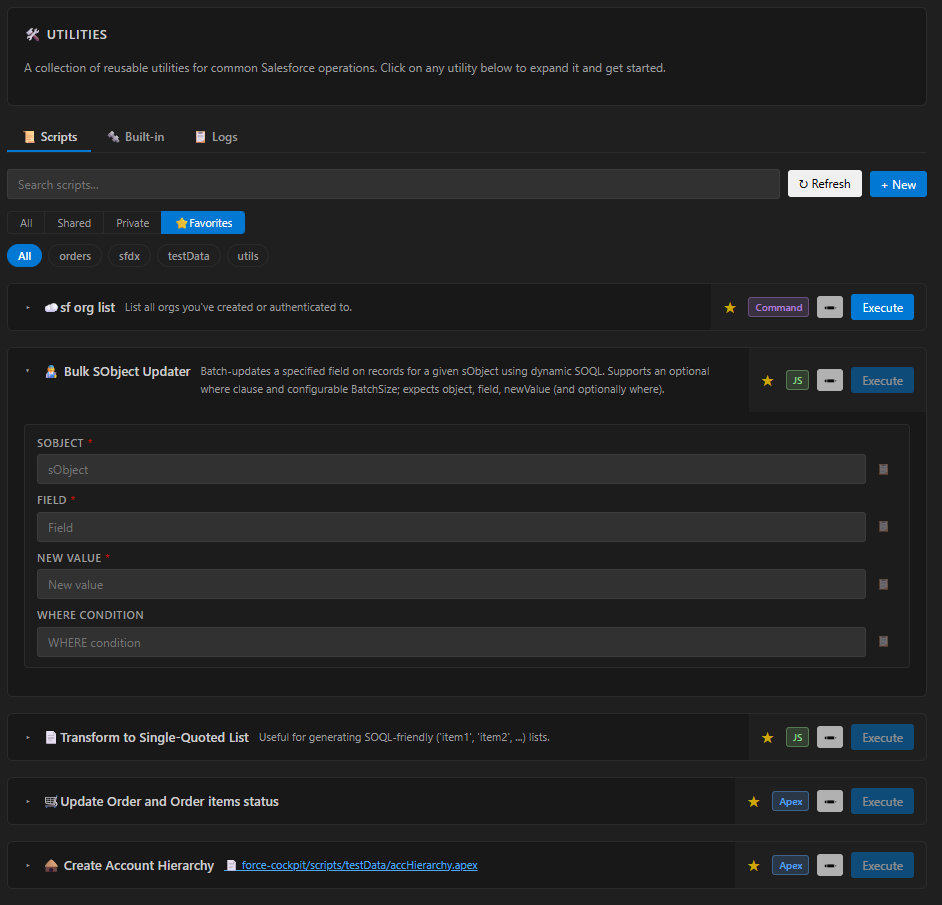
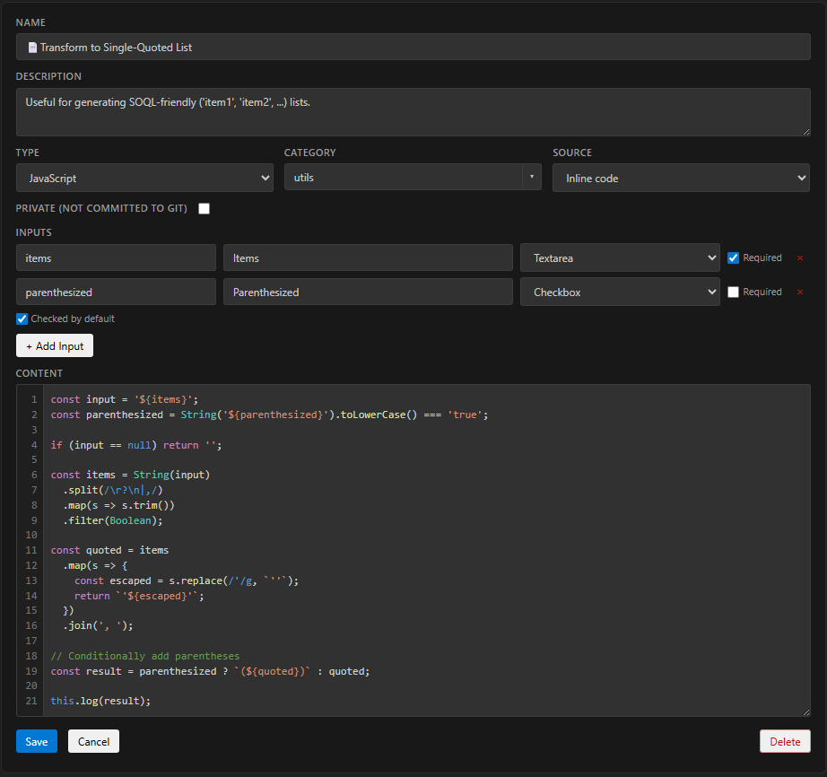
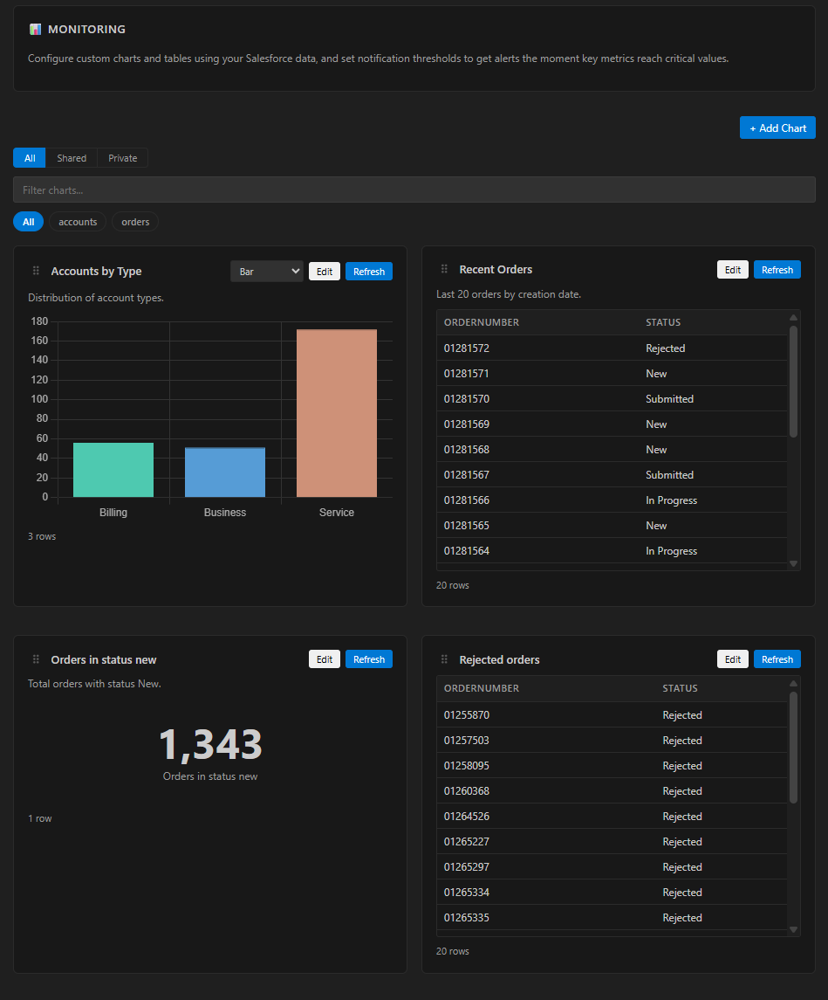

# Force Cockpit

[](https://marketplace.visualstudio.com/items?itemName=noriabits.force-cockpit)
[](https://marketplace.visualstudio.com/items?itemName=noriabits.force-cockpit)
[](https://marketplace.visualstudio.com/items?itemName=noriabits.force-cockpit)
[](https://github.com/noriabits/force-cockpit/actions/workflows/release.yml)
[](https://github.com/noriabits/force-cockpit/blob/main/LICENSE)

A VSCode cockpit for Salesforce orgs, built around your own automation. Connect via the SF CLI, then write Apex, shell, JavaScript, or AI-powered scripts — organized into folders and categories — to automate whatever your workflow needs, plus SOQL querying, REST calls, live monitoring dashboards, and AI-explained debug logs, all without leaving VSCode. Contact: Pablo Fernández Posadas [@paferpo](https://github.com/paferpo)

---

## Installation

### From the VS Code Marketplace

1. Open the Extensions panel (`Ctrl+Shift+X` / `Cmd+Shift+X`).
2. Search for **Force Cockpit**.
3. Click **Install**.

### From a `.vsix` file

1. Download the latest `.vsix` file from the [releases](https://github.com/noriabits/force-cockpit/releases).
2. In VSCode, open the Extensions panel.
3. Click the `...` menu → **Install from VSIX...** and select the file.

Alternatively, install from the terminal:

```bash
code --install-extension force-cockpit-<version>.vsix
```

### Prerequisites

- [Salesforce CLI (`sf`)](https://developer.salesforce.com/tools/salesforcecli) must be installed and on your `PATH`.
- You must be authenticated to at least one Salesforce org (`sf org login web`).

---

## Getting Started

1. Open a workspace that contains an SFDX project (or any folder).
2. Use the **Salesforce** extension to set your default org (`SFDX: Set a Default Org` command, or click the org name in the status bar).
3. Force Cockpit auto-connects to the `target-org` set in `.sf/config.json` at startup — and reconnects automatically whenever you switch orgs via the Salesforce extension.
4. Open the cockpit panel via the Command Palette: **Force Cockpit: Open Cockpit**.

If you switch orgs while an operation is in progress, a confirmation dialog appears. Confirming cancels any running operations and connects to the new org.

If the panel doesn't pick up an org change automatically (e.g. the file watcher missed an event, or the SF CLI hasn't finished writing the new credentials), click the 🔄 button next to the connection status in the panel header to force a fresh re-read of `.sf/config.json` and a reconnect. The same 🔄 Refresh action also appears inside the "No org connected" card.

---

## Tabs

| Tab            | Description                                                                                                                                                                                                                                             |
| -------------- | ------------------------------------------------------------------------------------------------------------------------------------------------------------------------------------------------------------------------------------------------------- |
| **Overview**   | Org info card, storage usage bars (Data Storage and File Storage), and an **Ask the AI** multi-turn chat card (with saved conversation history) for ad-hoc questions                                                                                    |
| **Scripts**    | Your own YAML-defined scripts (Apex, shell, JS, AI-assisted, REST), organized into folders — plus two built-in utilities (Clone User, Reactivate OmniScript)                                                                                             |
| **SOQL**       | SOQL query editor (keyword highlighting, tabs, history, autocomplete, Tooling toggle, explained errors) with a filterable, sortable results table                                                                                                       |
| **Monitoring** | SOQL-powered Chart.js dashboards loaded from YAML config files                                                                                                                                                                                          |
| **REST**       | Call any REST API or Apex REST endpoint on the connected org, with request tabs, custom headers, request history/saved requests, and a color-coded status + headers + clickable-record-Id response                                                      |
| **Debug Logs** | Set trace flags on any user (including the Automated Process user), then read the resulting Apex logs: filtered by category, summarised against the governor limits, with detected issues, an execution tree, a rated query-plan table, and AI analysis |

---

## Overview Tab

The Overview tab shows org connection details and storage usage bars (Data Storage and File Storage).

### Ask the AI

Once connected, the Overview tab also shows an **Ask the AI** card for ad-hoc questions — no need to author a YAML script first. It uses the same [Language Model API](https://code.visualstudio.com/api/extension-guides/ai/language-model) (GitHub Copilot) as AI scripts and the Debug Logs analysis panel, but as a **multi-turn conversation**: follow-up questions build on everything you already asked, including the results of any tool the model already ran.

**Requirements:** GitHub Copilot must be enabled in VS Code, and an org must be connected (the card is hidden otherwise).

Two read-only toggles control what the model can do this conversation:

- **Read workspace files** — search and read workspace source/metadata (Apex, objects, fields, flows, LWC, permission sets…), same as AI scripts' `allow-read-workspace-files`.
- **Query the org** — look up object schema (`describe_object`) and run **SELECT-only** SOQL, including against the **Tooling API** when needed (e.g. `FieldDefinition`, `EntityDefinition`, `ApexClass`) — the model picks which API a query needs on its own. It also knows which user you're connected as (no extra round-trip), so it can answer "do I have access to this field" instead of just describing the schema in the abstract. It can never write or modify data.

> [!NOTE]
> These two toggles are **locked once you ask your first question** — checking or unchecking them mid-conversation has no effect until you start a **New chat**. This keeps the model's declared tools consistent with what it already used earlier in the thread.

Your workspace's [Agent Skills](#ai-scripts) are **always available with no picker** — the model sees the same short id + description catalogue AI scripts do and can pull a skill's full content on demand via `read_skill`. There's nothing to select: since the question changes every time, the model decides which skill (if any) is relevant.

Use **New chat** to clear the conversation and unlock the toggles again. **Open as markdown** renders the whole conversation in VS Code's Markdown preview; **Copy** copies it as Markdown text. Switching orgs (or disconnecting) automatically starts a fresh conversation, since prior answers may reference org data from the previous connection.

**History ▾** lists your past conversations — one shared list, not scoped to any particular org. Every conversation is saved **as you go**: the moment each reply finishes, it's written to History under one entry for the whole conversation, so a question followed by three follow-ups shows up as a single row, not four — closing the panel, switching orgs, or the extension reloading never loses anything you've already seen an answer to. Click a row to reopen it (its transcript, model, and locked tool-access settings are all restored) and continue asking follow-ups — they keep updating that same entry — or click **×** to delete it. A very old or unusually large conversation may only restore its transcript for reading, without supporting true follow-up continuation — a small note appears in that case.

---

## Scripts Tab — YAML Scripts

<div align="center"></div>

> Scripts can also be created and edited directly in the UI — no need to write YAML by hand.

<div align="center"></div>

> [!TIP]
> The code field in the new/edit form is a simple textarea. For comfortable editing — syntax highlighting, multi-cursor, find & replace — click **✎ Open in editor** to edit the code body in a real VS Code editor tab. **Saving** there (Ctrl/Cmd+S) syncs the code straight back into the form (the form stays open); nothing is written to disk and your other fields are untouched. Click the form's **Save** to persist the whole script.

> [!TIP]
> Need a near-duplicate of a script? Open it for editing and click **Clone** — the form is pre-filled with every field of the original and `_copy` is added to the name. Tweak whatever you need and click **Save** to create the copy. Nothing is written until you Save, so the original stays untouched if you cancel.

> [!TIP]
> Prefer hand-editing the raw YAML? When editing an existing script, click **📄 Open YAML** to open its underlying `.yaml` file in a VS Code editor tab. The edit form closes (you've switched to raw editing, so there's no risk of a stale form **Save** overwriting your changes), and the script list refreshes automatically when you save the file. (The button only appears when editing an existing script.)

The **Custom** sub-tab executes scripts defined in YAML files. Five script types are supported (Apex, Command, JavaScript, **AI** — see [AI scripts](#ai-scripts) — and **REST** — see [REST scripts](#rest-scripts)). Scripts live under `force-cockpit/scripts/{category}/*.yaml` (shared) or `force-cockpit/private/scripts/{category}/*.yaml` (private, git-ignored). Sub-categories are also supported: `{category}/{sub-category}/*.yaml` gives a second row of pills for drilling down.

> [!TIP]
> **Repository examples:** Ready-to-use YAML script examples are available under [`force-cockpit/scripts/examples/`](force-cockpit/scripts/examples). They live in this repo rather than inside the extension — copy the ones you want into your own `force-cockpit/scripts/` folder.

> [!TIP]
> **Writing scripts with an AI assistant?** This repo ships an [Agent Skill](force-cockpit/skills/force-cockpit-yaml-scripts/SKILL.md) documenting the full script schema — every field, the placeholder escaping rules, the JS sandbox API and the chaining model. Copy the `force-cockpit-yaml-scripts/` folder into your workspace's `.claude/skills/` (or `.github/skills/`) and your assistant will author valid scripts first time. That location is also where Force Cockpit's own AI scripts look for skills, so the same copy shows up in the **Skills** picker.

```yaml
# Apex script — requires org connection
name: My Apex Script
description: What this script does.
apex: |
  System.debug('Hello from Apex');

# Terminal command — no org connection required
name: My Command
description: Runs a local shell command.
command: npm run build

# JavaScript script — runs in Node.js VM sandbox, org connection is optional
name: My JS Script
description: Query Salesforce with jsforce.
js: |
  const result = await query("SELECT Id, Name FROM Account LIMIT 5");
  log(JSON.stringify(result.records, null, 2));

# REST script — one REST / Apex REST call against the connected org
name: Create Account
description: Creates an Account through the REST API.
rest:
  method: POST
  endpoint: /services/data/v65.0/sobjects/Account
  body: |
    { "Name": "Acme" }
```

Exactly one of `apex:`, `command:`, `js:`, `ai:`, or `rest:` is required. Click **Execute** on any script card to run it.

### Configurable Inputs

Scripts can declare input variables that are prompted at execution time. Add an `inputs:` section to your YAML:

```yaml
name: Update Order Status
description: Updates an order and its line items.
inputs:
  - name: orderId
    label: Order ID
    required: true
  - name: status
    label: Status
    type: picklist
    required: true
    options:
      - New
      - Submitted
      - Completed
      - Cancelled
      - In Progress
apex: |
  Id orderId = '${orderId}';
  // ... use orderId and status in your Apex code
```

Each input supports:
| Field | Required | Description |
|-------|----------|-------------|
| `name` | Yes | Variable identifier (alphanumeric + underscore) — used as `${name}` in the script body |
| `label` | No | Display label (defaults to `name`) |
| `type` | No | `string` (text input, default) or `picklist` (dropdown) |
| `required` | No | If `true`, Execute is disabled until the field is filled |
| `options` | Picklist only | List of selectable values |

Write `${variableName}` in your script code where you want the value substituted. Escaping is handled automatically (Apex-safe for `apex`, JSON-safe for `js`, raw for `command`).

### System Placeholders

In addition to user-defined inputs, scripts can use built-in system placeholders that are automatically resolved from the connected org:

| Placeholder      | Description                                          |
| ---------------- | ---------------------------------------------------- |
| `${orgUsername}` | Salesforce username (not alias) of the connected org |

System placeholders use the same `${name}` syntax and type-appropriate escaping as user inputs. If no org is connected, they resolve to an empty string. If a user-defined input has the same name as a system placeholder, the user input takes precedence.

```yaml
name: Show My User
apex: |
  System.debug('Running as: ${orgUsername}');
```

| Type       | Badge  | Org required | Output                                  |
| ---------- | ------ | ------------ | --------------------------------------- |
| Apex       | Blue   | Yes          | Debug log (USER_DEBUG filter available) |
| Command    | Purple | No           | stdout/stderr                           |
| JavaScript | Green  | No           | `log()` / `console.log()` output        |
| AI         | Orange | Yes          | Streamed model analysis                 |

**JS script context**: `connection` (jsforce Connection or null), `org` (OrgDetails or null), `query(soql)`, `log()`, `error()`, `console`, `fs`, `path`, `yaml`, plus `runScript()` / `setOutput()` for [composing scripts](#composing-scripts).

Apex scripts run at a quiet, fixed log level (`Apex Code: DEBUG`, `System: ERROR`, everything else `NONE`) — the log holds just your own `System.debug()` output plus any unhandled exception, nothing else. This level is independent of anything configured in the Debug Logs tab: Salesforce always honors the log level a script execution explicitly requests over an org-wide trace flag, so a Debug Logs preset has no effect on a yaml-script's own log.

### Composing scripts

Shared logic can live in one script and be reused by others instead of being copy-pasted. There are two ways to chain, and they interoperate:

**`then:` — a declarative list, available on every script type.** The steps run in order once the script's own body succeeds, so an Apex script keeps all its Apex _and_ hands off when it's done:

```yaml
name: 🛖 Create Account Hierarchy
inputs:
  - name: accountName
    label: Account Name
    required: true
  - name: cartType
    label: Enterprise cart
    type: picklist
    options: [None, Quote, Order]
apex-file: force-cockpit/scripts/testData/accHierarchy.apex
then:
  - script: testData/create-enterprise-cart
    when: ${cartType} !== "None" # skip the step entirely for None
    with:
      accountId: ${contractantAccId} # published by the Apex above
      cartType: ${cartType} # this script's own input
      namePrefix: ${accountName}
```

A step may carry a `when:` guard. Both outcomes are logged with the substituted expression beside the original (`when: ${cartType} !== "None" → "Quote" !== "None"`), so a guard that fires the wrong way shows its own reason — `→ "" !== "None"` means the value never reached the condition. A `when:` is a **JavaScript expression** — `&&`, `||`, `!`, parentheses, ternaries and string methods all work, so `when: ${cartType} !== "None" && ${status} === "Active"` does what it looks like. Placeholders are substituted as literals (a checkbox becomes a real boolean, so a bare `${flag}` reads as "if ticked"), which means values can never inject code, and **comparands must be quoted**: `!== "None"`, not `!== None`. A syntax error or an unquoted comparand marks the script invalid when it loads, before anything runs. The expression is evaluated in a sandbox with no `require`, no `process` and a 100 ms timeout.

**`runScript(id, inputs?, options?)` — imperative calls inside a `js` script**, for when the chain needs conditionals, loops or error handling. It resolves with the callee's result and rejects if the callee fails (pass `{ throwOnError: false }` to handle that yourself).

```yaml
name: 🔁 Bulk Create Contacts
inputs:
  - name: accountId
    required: true
  - name: lastNames
    type: textarea
    required: true
js: |
  const accountId = "${accountId}";
  const names = input.parseLines("${lastNames}", ['lastName']).map((r) => r.lastName);

  for (const lastName of names) {
    const result = await runScript(
      'examples/create-contact-for-account',
      { accountId, lastName },
      { throwOnError: false }, // one bad row must not lose the rest
    );
    log(result.success ? 'created ' + result.outputs.contactId : 'failed: ' + result.message);
  }
```

A loop, a value read back and per-item error handling — none of which `then:` can express. Both this and the `then:` example above live in the repo under [`force-cockpit/scripts/examples/`](force-cockpit/scripts/examples) — copy them into your own `force-cockpit/scripts/` folder to try them.

Because every call is a separate transaction, a script hands values on by publishing them — and any kind can hand a value to any other kind:

| Kind       | How it publishes a value                                  |
| ---------- | --------------------------------------------------------- |
| Apex       | `System.debug('::fc-output accountId=' + acc.Id);`        |
| Command    | `echo "::fc-output buildId=$BUILD_ID"` on stdout          |
| JavaScript | `setOutput('target', 'staging')` — **not** a printed line |

A caller reads them as `result.outputs` in JS, or interpolates them as `${name}` in a `then:` step's `with`. Nothing is inherited — a called script sees only what `with:` hands it, so a value needed several scripts down must be forwarded at each hop. Values are always strings, and escaping is handled for the _receiving_ script's type — pass raw values, never pre-escape. A name nothing published resolves to empty rather than to the literal text `${name}`, so a `required:` input on the callee reports it cleanly.

> [!WARNING]
> In a JavaScript script, `log('::fc-output foo=bar')` does nothing — a JS script's log also contains the logs of everything it called, so it is never scraped for markers. Use `setOutput()`. Note also that command scripts receive values unescaped, since a shell has no safe universal quoting.

Values flow **forwards only**: `with:` feeds the caller's outputs into the step it starts, and a caller can never read what its `then:` step produced — publishing outputs from the last script in a chain is dead code. Use `runScript()` when you need a result back.

Chains nest (a script reached by `then:` runs its own `then:` too) and run depth-first, so for a root with steps `x` and `y` where `x` chains to `x1`, the order is `root → x → x1 → y`. The callee's output streams into the caller's log under a `── ▶ {id} ──` header, so the whole run is visible in one card. Cancelling cancels the chain. Circular calls are rejected and nesting is capped at 10 levels. A `js` script only reports the outputs it sets itself — re-export a callee's value with `setOutput` to pass it further up.

> [!NOTE]
> The script form has no editor for `then:`; author it in the YAML via **📄 Open YAML**. Saving from the form preserves it.

> [!NOTE]
> The confirmation prompt shown on production and protected sandboxes appears **once**, for the script you clicked — called scripts do not prompt again.

### AI scripts

An **AI script** optionally gathers Salesforce data with a _fixed, author-defined_ step and then uses a language model (via VS Code's built-in [Language Model API](https://code.visualstudio.com/api/extension-guides/ai/language-model), powered by GitHub Copilot) to **analyse** it. The analysis streams into the script's output. The gather step is optional — omit it (uncheck "Gather data first" in the form) for a script driven purely by its prompt + inputs.

**Requirements:** GitHub Copilot must be enabled in VS Code (the first run shows a one-time consent prompt), and an org must be connected.

```yaml
name: Energy account analysis
description: Summarises energy-industry accounts.
model: auto # the chosen model's id — the form requires one and defaults to Copilot's "Auto"
inputs:
  - name: industry
    label: Industry
    required: true
gather: # OPTIONAL fixed data step — exactly one of soql / apex / apex-file (omit for a prompt-only script)
  soql: SELECT Id, Name, AnnualRevenue FROM Account WHERE Industry = '${industry}'
ai: | # the analysis prompt (use ai-file: to load it from a file)
  Summarise the accounts below and flag anything unusual about their revenue.
allow-followup-queries: true # optional — lets the model run follow-up SOQL for extra context
allow-read-workspace-files: true # optional — lets the model search & read workspace files (any non-gitignored source/metadata)
skills: # optional — ids of skills the model may read on demand
  - data-quality-checklist
```

How it works and why it's safe:

- **You control the data step.** The `gather` SOQL/Apex is yours and runs exactly as written — the model never writes or chooses Apex, so there is **no risk of it modifying data**.
- **The model only analyses.** It receives the gathered data + your prompt and replies with text.
- **Optional follow-up queries.** With `allow-followup-queries: true`, the model may run additional **SOQL** queries (`SELECT` only) to pull more context — against the Standard API for everyday business data, or the **Tooling API** for metadata objects (`FieldDefinition`, `EntityDefinition`, `ApexClass`, `TraceFlag`…) when the model determines it needs to. It can never run anything that writes.
- **Optional workspace file access.** With `allow-read-workspace-files: true`, the model can **search** workspace files by name (a case-insensitive regular expression — a plain word like `Selector` matches `OrderSelector`, `AccountSelector`) and **read** any matching source/metadata file (Apex, objects, fields, flows, LWC, permission sets…). Handy for diagnosing stack traces across your metadata. Anything excluded by your `.gitignore` (e.g. `force-cockpit/private/`) is never listed or read.
- **Model picker.** Picking a model is **required** (the field is marked with a red `*`). The list is populated from the models Copilot offers — de-duplicated and sorted alphabetically — and **defaults to Copilot's "Auto"** model when it's available. If a script's saved model is no longer available at run time, Force Cockpit falls back to **Auto** (or the first available model), prepends a warning to the output, and shows a notification — so the run still completes. Note: some models don't support follow-up queries — gather + analyse still works regardless.
- **Skills (reusable playbooks).** Tick **Skills** in the form to attach [Agent Skills](https://code.visualstudio.com/api) — markdown guides stored as `{skill-id}/SKILL.md` under `.claude/skills` or `.github/skills` in your workspace. The model sees a short catalogue (id + description) of the attached skills and can pull a skill's full content on demand via a tool; nothing is auto-injected. Override the scanned folders with `skillsPaths` in `force-cockpit/config.yaml`.
- **Schema is cached locally.** Before querying, the model checks object fields via a `describe_object` tool. Results are cached per workspace under `force-cockpit/.describe-cache/` (git-ignored, 2-week expiry) and shared with the SOQL tab's autocomplete, so repeated lookups don't hit the org. Click the 🔄 refresh button next to the connection status to clear the cache and re-pull the latest schema.
- **Knows who it's connected as.** The model always has access to your connected username (no round-trip needed) — since `describe_object`'s field list already reflects that user's field-level security, this lets it answer "can I see this field" directly instead of describing schema in the abstract.
- **Open as markdown.** AI analysis is written in Markdown. Once a run finishes, an **Open as markdown** button (next to _Open in editor_ / _Copy to clipboard_) opens the output in VSCode's built-in Markdown preview — headings, lists, tables, and code blocks rendered nicely. Nothing is written to disk; it opens an in-memory untitled document. The gathered data is shown as a code block in the preview.

`${input}` and `${orgUsername}` placeholders work in both the prompt and the gather step.

### REST scripts

A `rest:` script fires **one REST / Apex REST request** against the connected org — the same thing the [REST Tab](#rest-tab) does interactively, but saved, parameterised and chainable. Requires a connected org.

```yaml
name: Deactivate a user
description: Sets IsActive = false on a user.
inputs:
  - name: userId
    label: User Id
    required: true
rest:
  method: PATCH                    # optional; GET | POST | PUT | PATCH | DELETE (default GET)
  endpoint: /services/data/v65.0/sobjects/User/${userId}
  headers:                         # optional
    Sforce-Auto-Assign: 'FALSE'
  body: |                          # optional; or `body-file: path/from/workspace/root.json`
    { "IsActive": false }
```

- **The response is the output.** The log shows the request line, the status code, the response headers and the pretty-printed body (rendered as a table by default — untick **Format JSON** for raw).
- **A non-2xx response fails the script.** Unlike the REST tab, which renders a 404 as an ordinary result, a script treats it as a failure so a `then:` chain stops instead of passing a bad response to the next step. Salesforce's own error message and `errorCode` are shown.
- **Chaining works out of the box.** A rest script publishes `${status}` plus **every top-level value of a JSON response body** — so Salesforce's `{"id": "001…", "success": true}` gives the next script `${id}` with no parsing step:

  ```yaml
  rest:
    method: POST
    endpoint: /services/data/v65.0/sobjects/Account
    body: '{ "Name": "${accountName}" }'
  then:
    - script: examples/create-contact-for-account
      with:
        accountId: ${id}
  ```

  Nested objects and lists are skipped (a chained value is always a string), and `${status}` always means the HTTP status even if the body has a field of that name.
- **Placeholders** work in the endpoint, the header values and the body. Body values are JSON-escaped, so an apostrophe or a quote in an org value can't break the payload. Endpoint values are inserted **as-is, without URL-encoding** — the same as typing them in the REST tab — so if a value may contain `&`, `?` or a space, encode it yourself.
- **The body must be a string** — a `|` block, or quoted as in the example below. Inline JSON (`body: {"Name": "Acme"}`) is a YAML *mapping*, not a string, and the script is rejected as invalid rather than silently sending an empty body.
- **Absolute URLs are allowed** (`https://…`), matching the REST tab. Be aware that your org's access token is sent as a `Bearer` header on those requests too, so only point a script at a host you trust.
- **Cancellable.** The **✕ Cancel** button aborts the request in flight, not just its reply.

> [!TIP]
> Need a loop, a condition, or several requests in one run? Use a `js:` script instead and call **`restCall(method, endpoint, body?, headers?)`** — the body may be a string or an object (serialized to JSON for you). It returns `{ status, statusText, headers, body }` and, unlike the raw jsforce `connection.request()`, does **not** throw on a 4xx/5xx, so you can branch on the status directly:
>
> ```yaml
> js: |
>   const r = await restCall('GET', `/services/data/v65.0/sobjects/Account/${accountId}`);
>   if (r.status === 404) { log('No such account'); return; }
>   log(r.body.Name);
> ```

### Private scripts

Check **Private** when creating or editing a script to save it to `force-cockpit/private/scripts/` instead of the shared folder. The extension automatically adds `force-cockpit/private/` to `.gitignore` on startup. Private scripts show a 🔒 badge and can be filtered with the **All / Shared / Private** control. You cannot save a private script with the same category + name as an existing shared one.

---

## SOQL Tab

The SOQL tab provides a full-featured query editor (run with **Run Query** or `Cmd`/`Ctrl`+`Enter`).

The editor supports:

- **Keyword highlighting** — clauses, functions, string and number literals and comparison operators are colour-coded as you type, using your VS Code theme's colours.
- **Auto-capitalized keywords** — `select`, `from`, `where`, `and`, `order by`… are uppercased automatically the moment you finish typing them, matching the Salesforce documentation convention. Object and field names are left exactly as you typed them — including standard objects like `Order` or `Group`, which are never mistaken for the `ORDER`/`GROUP` clause keywords.
- **Query tabs** — keep several queries open at once. Use **+** to add a tab, **⧉** to clone the active one (query, name and Tooling toggle carried over), double-click a tab to rename it, drag a tab to reorder it, and **×** to close it. New tabs start pre-filled with `SELECT Id FROM ` (cursor ready for the object name). Tabs are named after the object in the `FROM` clause as you type — `Order`, and repeats get `Order (1)`, `Order (2)`. A query opened from **History ▾ → Saved** takes that query's own saved name, and keeps it for as long as the query still targets the same object; change the `FROM` object and the tab goes back to naming itself after it. Double-click to give a tab your own name instead — that one sticks for good; clear it to hand the tab back to automatic naming. Tab names and queries are saved per workspace and restored when you reopen the panel (results are not persisted).
- **History** — every query you run is recorded under **History ▾ → Recent** (newest first, deduped). Click **★ Save** to store the current query under a name (**History ▾ → Saved**). The name box comes pre-filled with the current tab's title, so a tab you already renamed (or opened from **Saved**) saves under that same name in one keystroke — and if you type a different name before confirming, the open tab is relabeled to match. Picking any entry opens it in **a new tab**, so it never overwrites the query you have open — unless the current tab is still empty, in which case it's reused rather than leaving a blank tab behind. Picking a **Saved** entry that's already open in one of your tabs switches to that tab instead of opening a duplicate — resetting it to the saved query right away if you haven't touched it, or asking first if it has changes you haven't saved.
- **SOQL autocomplete** — as you type, suggestions appear for sObjects (after `FROM`), fields and relationships (in `SELECT` / `WHERE` / `ORDER BY` / `GROUP BY`, including dotted traversal like `Account.Owner.Name`), and picklist values inside `WHERE … = '…'`. Press `Ctrl`/`Cmd`+`Space` to force suggestions; `↑`/`↓` to move, `Enter`/`Tab` to insert, `Esc` to dismiss.
- **Tooling API** — tick **Tooling API** to run the query against the Tooling API (e.g. `ApexClass`, `Flow`).
- **Write the query for me (✨ Ask AI)** — describe the records you want in plain language, or ask about the query you already have open. See [below](#generating-a-query-with-ai).
- **Explained errors** — when a query fails, the Salesforce error is shown exactly as returned, with an explanation added underneath.

  This matters most for permissions. Salesforce rejects a field you're not allowed to _see_ with the same `No such column 'X' on entity 'Y'` message it uses for a genuine typo, so you end up hunting for a spelling mistake that isn't there. Force Cockpit checks the field against the org's full metadata and tells you which it is:

  > 🔒 **`AssetReferenceId__c` exists but field-level security is hiding it** — The field is defined on QuoteLineItem (Asset Reference Id, Text), but your user has no Read access to it. Ask an admin to assign you one of the permission sets below, or add Read access to this field on one you already have.
  > **Granted by:** `Sales_Ops_Extended (Permission Set)` `Field_Access_PSG (Permission Set Group)`

  It also names _which_ permission set or permission set group would actually fix it, so you're not just told "ask an admin" — you can ask for a specific one. If nothing currently grants it, it says so instead of guessing.

  If the field really doesn't exist you get a **Did you mean:** list of the closest names instead. The same applies to mistyped relationships (`Accont.Name`) and objects, including objects that exist but that your user cannot access.

  Reading the full field list, and looking up which permission set grants it, both need the **View Setup and Configuration** permission. Without it you still get suggestions — the message just says that a field hidden by field-level security couldn't be ruled out.

The results table supports:

- **Filter** — type in the filter box above the table to narrow rows by a case-insensitive match across all columns; a counter shows how many of the total rows match.
- **Sort** — click any column header to sort; click again to reverse.
- **Copy a column** — click the **⧉** button on a column header to pick a copy format for that column's values: **one per line** (`a`⏎`b`), **comma-separated** (`a,b`), **quoted list** (`'a', 'b'`) or **IN-clause** (`('a', 'b')`, ready to paste after a `WHERE … IN`). Every format copies the current view — so it respects the filter and the sort — with duplicates and blanks dropped.
- **Copy a cell** — hover any cell and a **⧉** button appears at its left edge; one click copies that cell's full value, including the part cut off by the column width.
- **Open records** — any Salesforce record Id in a cell renders as a link that opens the record in your browser.
- **Export** — **Export CSV** / **Export JSON** writes the current (filtered and sorted) view to a timestamped `query-result-…` file in your workspace root and opens it in the editor.

---

### Generating a query with AI

Click **✨ Ask AI** in the query toolbar and describe what you want — _"opportunities for Acme that closed this year"_.

**What's on your screen goes along with your question** — both the query in the editor and the results of your last run. So you can ask about a query you're stuck on (_"why doesn't this work?"_, _"also filter by owner"_, _"make this count by stage instead"_) and about the data that came back (_"why is Amount empty on these?"_, _"which of these have no owner?"_). The assistant starts from your query and changes only what you asked for. If you're asking why it fails, it runs your query first so it's explaining the real error rather than guessing at one.

Only a small sample of rows is sent (the first few, trimmed to stay within the model's limits) along with the true row count — so the assistant knows how many records you really matched, and runs a query when it needs more than the sample can tell it.

Either way, it works against your connected org:

1. **Finds the real schema.** It narrows to the objects your request most likely means and looks up their fields, so it uses your org's actual API names rather than guessing. If you didn't type an object name exactly, it searches for the closest match instead of giving up.
2. **Proves the query runs before showing it to you.** Every candidate is executed against your org, capped at one row. If it fails, the assistant reads the same explained errors described above — including whether a field is genuinely missing or merely hidden from you by field-level security — and fixes the query itself, rather than handing you something broken.
3. **Checks it means what you asked.** It compares the fields that actually came back against your request, and tells you how it read anything vague ("closed this year" → `IsClosed = true AND CloseDate = THIS_YEAR`). If the query is valid but matched no records, it says so and names the filter it suspects.
4. **Asks when it genuinely can't tell.** If "Acme" could plausibly mean two different fields, you get a short question instead of a guess. Answer in the same box — it's a conversation, so you can also refine a query it already proposed ("only ones over £50k").

The proposed query appears with **▶ Run query**, which drops it into the current tab and runs it exactly as if you had typed it — including ticking **Tooling API** for you when the query needs it. The conversation above shows each check as it happens, so you can see exactly what was run against your org and what came back.

Everything the assistant can do here is read-only: it looks up schema and runs `SELECT` queries, and can never modify data. Note that the sample rows described above are sent to the language model along with your question, the same way any data it queries itself is. Requires GitHub Copilot (see [AI Scripts](#ai-scripts) for model setup); **New chat** starts a fresh conversation, and switching orgs clears it automatically.

## Monitoring Tab

<div align="center"></div>

The Monitoring tab displays live charts built from SOQL queries. Each chart is defined by a YAML configuration file. Charts are rendered using [Chart.js](https://www.chartjs.org/) and can be refreshed manually or on a timer.

### Where charts come from

Charts are loaded from two sources (merged at runtime, later wins):

| Source           | Path                                                             | Purpose                                   |
| ---------------- | ---------------------------------------------------------------- | ----------------------------------------- |
| **User-defined** | `{workspace}/force-cockpit/monitoring/{category}/*.yaml`         | Your own charts, committed to git         |
| **Private**      | `{workspace}/force-cockpit/private/monitoring/{category}/*.yaml` | Personal charts, **not** committed to git |

The user-defined path can be customised via the VSCode setting `forceCockpit.cockpitPath` (see [Configuration](#configuration)).

### Private charts

Checking **Private** in the chart edit form saves the config to `force-cockpit/private/monitoring/` instead of the shared folder. The extension automatically adds `force-cockpit/private/` to `.gitignore` on startup so these files are never committed.

Private charts show a 🔒 badge on their card. Use the **All / Shared / Private** filter above the category pills to show only the configs you care about.

You cannot save a private chart with the same category + name as an existing shared one (and vice versa) — the extension will show an error.

### Sub-categories

Monitoring configs support two levels of nesting: `{category}/{sub-category}/*.yaml`. Clicking a parent category pill reveals a second row of narrower sub-pills to drill down.

### Adding a new monitoring chart

1. **Pick or create a category folder** under `force-cockpit/monitoring/` in your workspace:

   ```
   {workspace}/
   └── force-cockpit/
       └── monitoring/
           └── orders/          ← any name you like
               └── my-chart.yaml
   ```

2. **Create the YAML file** using the schema below.

3. **Reload the Monitoring tab** — your chart appears automatically. No rebuild or restart needed.

### Deleting a chart

Click **Edit** on the card → click the red **Delete** button in the form → confirm in the modal. User and private charts are removed from disk. Built-in charts — the example dashboards under [`force-cockpit/monitoring/`](force-cockpit/monitoring), which you get by cloning this repo rather than from the extension itself — cannot be deleted from disk, so they are hidden in your workspace instead. A "Restore hidden built-ins (N)" link appears in the top toolbar so you can bring them back.

### YAML schema

```yaml
name: Open Orders by Status # Display name shown on the card
description: Count of open orders grouped by status. # Subtitle shown on the card

soql: |
  SELECT Status, COUNT(Id) RecordCount
  FROM Order
  WHERE Status != 'Cancelled'
  GROUP BY Status

labelField: Status # API name of the field used as chart labels (X-axis or pie slices)

valueFields: # One or more datasets to plot
  - field: RecordCount # API name of the numeric field
    label: Orders # Legend label for this dataset
    format: number # optional: number | currency | percent

chartType: bar # bar | line | pie | doughnut | metric | table
stacked: false # true = stacked bars/lines (bar and line only)
notifyOnIncrease: false # true = fire a notification when totalRows grows between two refreshes
refreshInterval: 0 # Auto-refresh in seconds. 0 = manual refresh only
```

### Field reference

| Field                  | Required | Values                                                        | Description                                                                                                                                            |
| ---------------------- | -------- | ------------------------------------------------------------- | ------------------------------------------------------------------------------------------------------------------------------------------------------ |
| `name`                 | Yes      | string                                                        | Card title                                                                                                                                             |
| `description`          | No       | string                                                        | Card subtitle                                                                                                                                          |
| `soql`                 | Yes      | SOQL string                                                   | Any valid SOQL query                                                                                                                                   |
| `labelField`           | Yes\*    | API name                                                      | Field whose values become chart labels or the first table column. \*Not required for `metric` type.                                                    |
| `valueFields`          | Yes      | array                                                         | At least one `{ field, label }` entry                                                                                                                  |
| `valueFields[].field`  | Yes      | API name                                                      | Field to plot or display                                                                                                                               |
| `valueFields[].label`  | Yes      | string                                                        | Dataset legend label or column header                                                                                                                  |
| `valueFields[].format` | No       | `currency` \| `percent`                                       | Number formatting on axes, tooltips, and table cells                                                                                                   |
| `chartType`            | No       | `bar` \| `line` \| `pie` \| `doughnut` \| `metric` \| `table` | Default chart type (user can override for chart types)                                                                                                 |
| `stacked`              | No       | `true` \| `false`                                             | Stack bars or lines (bar and line only)                                                                                                                |
| `notifyOnIncrease`     | No       | `true` \| `false`                                             | Fire a VSCode warning whenever the row count grows between two auto-refreshes (e.g. new error records appearing). Snoozable for 1 hour or for the day. |
| `refreshInterval`      | No       | integer (seconds)                                             | `0` disables auto-refresh                                                                                                                              |

> **Background notifications:** Charts with thresholds or `notifyOnIncrease: true` keep auto-refreshing in the background even when the Force Cockpit panel is closed, so threshold breaches and row-count growth alerts still fire. Row-count growth also plays a short OS audio cue — best-effort, using your platform's own sound player (`afplay` on macOS, PowerShell's `SoundPlayer` on Windows, `paplay`/`pw-play`/`canberra-gtk-play` on Linux). If none of them is available the notification still appears, just silently. Charts without these flags only refresh while the panel is open. Disconnect from the org and the background polling stops.

### Multiple datasets (grouped charts)

You can plot multiple fields from the same query side by side:

```yaml
name: Order Amounts by Status
soql: |
  SELECT Status, SUM(TotalAmount) Total, COUNT(Id) Count
  FROM Order
  GROUP BY Status
labelField: Status
valueFields:
  - field: Total
    label: Total Amount (€)
    format: currency
  - field: Count
    label: Number of Orders
chartType: bar
refreshInterval: 60
```

### Stacked bars

Add `stacked: true` to a `bar` or `line` chart with multiple `valueFields` to render them as stacked segments:

```yaml
name: Revenue by Category
soql: SELECT Name, Hardware__c, Software__c, Services__c FROM Account__c
labelField: Name
valueFields:
  - field: Hardware__c
    label: Hardware
    format: currency
  - field: Software__c
    label: Software
    format: currency
  - field: Services__c
    label: Services
    format: currency
chartType: bar
stacked: true
```

### Metric cards (KPI)

Use `chartType: metric` to display a single large number. `labelField` is not required. The first value of the first `valueField` is shown as the headline number:

```yaml
name: Open Orders
description: Total orders waiting to be processed.
soql: SELECT COUNT(Id) Cnt FROM Order WHERE Status = 'Open'
valueFields:
  - field: Cnt
    label: Open Orders
chartType: metric
refreshInterval: 30
```

### Table view

Use `chartType: table` to render a scrollable, sortable table. Works with any SOQL — aggregate or not. Click any column header to sort. Use `format: currency` or `format: percent` on valueFields to format numeric columns.

Each table card has a search box above the table that filters its rows in real time by any field (case-insensitive substring match across every column). A small counter next to the input shows `X of Y` so you can see how aggressive your filter is. The filter text persists across auto-refresh of the same card.

Any cell whose value is an 18-character Salesforce record Id (validated via the standard Salesforce case-safe checksum) is rendered as a clickable link that opens the record in your browser — no extra configuration needed. This works for `Id`, `OwnerId`, `AccountId`, and any other lookup or aliased Id column. 15-character Ids pasted into custom text fields are not auto-linked, since they have no checksum to verify and would risk false positives on plain text values.

```yaml
name: Recent Orders
description: Last 20 orders by creation date.
soql: |-
  SELECT OrderNumber, Status, TotalAmount
  FROM Order
  ORDER BY CreatedDate DESC
  LIMIT 20
labelField: OrderNumber
valueFields:
  - field: Status
    label: Status
  - field: TotalAmount
    label: Amount (€)
    format: currency
chartType: table
```

### Examples

> [!TIP]
> **Repository examples:** There are example charts in this repository under `force-cockpit/monitoring/examples/`.

### Editing and saving charts in the UI

Each card has an **Edit** button that opens an inline form. Changes to the SOQL field trigger an auto-preview after 800 ms. Check **Private** to save to the private folder; leave unchecked to save to the shared workspace path. Clicking **Save** writes the YAML — it never overwrites a built-in chart's own file.

---

## REST Tab

The REST tab lets you call any REST API or Apex REST endpoint on the connected org, reusing the extension's authenticated session — no need to copy access tokens or set up a separate HTTP client.

1. **Pick an HTTP method** — `GET`, `POST`, `PUT`, `PATCH`, or `DELETE`.
2. **Enter the endpoint path** — a relative path is prefixed with the org's instance URL automatically, e.g. `/services/data/v65.0/limits` or `/services/apexrest/api/orderUpdate`. A full `https://…` URL is used as-is. Use the 📋 button to paste from the clipboard.
3. **Add custom headers** (optional) — click **+ Add header** for any extra headers your endpoint needs (e.g. `Sforce-Auto-Assign`). A default `Content-Type: application/json` header is sent; a custom header with the same name overrides it.
4. **Add a JSON body** (optional) — used for `POST` / `PUT` / `PATCH`; ignored for `GET` / `DELETE`.
5. **Send** the request with the **Send** button or `Cmd`/`Ctrl`+`Enter`. Use **✕ Cancel** to abort one that is taking too long — the request is genuinely cancelled, not just ignored. The response shows a color-coded status code, a collapsible list of response headers, and the pretty-printed JSON body — any Salesforce record Id in the response is a clickable link that opens the record in your browser. The response box border is colored to match (green/amber/red). A non-2xx response (e.g. `404`, `400`) is shown as a normal response, not an error — only network-level failures (e.g. no connectivity) show as an error. Below the response body, use **Open in editor** to view the full body in a native VSCode editor tab, or **Copy to clipboard** to copy it directly.

**Request tabs** — keep several requests open at once. Use **+** to add a tab, **⧉ Clone** to copy the active one (method, endpoint, body and headers carried over), double-click a tab to rename it, drag a tab to reorder it, and **×** to close it. Tabs are named after the last part of the endpoint as you type — `/services/data/v65.0/sobjects/Account` becomes `Account`, and repeats get `Account (1)`, `Account (2)`; a tab with no endpoint yet is named after its method (`POST Request`). Double-click to give a tab your own name instead — that one sticks for good; clear it to hand the tab back to automatic naming.

Each tab sends independently, so you can fire off a slow request in one tab and carry on working in another — a tab with a request in flight shows a `⋯` next to its name, and its response lands in that tab whichever one you are looking at when it arrives.

**History & saved requests** — every successful send (including non-2xx responses) is recorded in the **History ▾** dropdown, with the method badge first and the endpoint next, so you can quickly re-run or tweak a past request. Click **★ Save** to name and keep a request permanently under "Saved" — useful for endpoints you call often. The name box comes pre-filled with the current tab's title, so a tab you already renamed (or opened from **Saved**) saves under that same name in one keystroke — and if you type a different name before confirming, the open tab is relabeled to match. Picking anything from **History ▾** opens it in **its own tab**, so it never overwrites the request you have open (an empty tab is reused rather than leaving a blank behind) — unless the entry is already open in one of your tabs, in which case that tab is reused instead of duplicated: reset to the saved request right away if you haven't touched it, or after confirming if it has changes you haven't saved. A request opened from **Saved** takes that request's own saved name and keeps it for as long as the endpoint still points at the same resource; change the endpoint and the tab goes back to naming itself after it.

Your tabs (method, endpoint, body, headers and names) are saved per workspace and restored when you reopen the panel — responses are not persisted. If you used the REST tab before it had tabs, the request you had open becomes your first tab.

> [!WARNING]
> When you are connected to a **production org or a protected sandbox**, sending a `POST` / `PUT` / `PATCH` / `DELETE` request prompts for confirmation first, since these verbs can modify live data. `GET` requests are sent without a prompt.

---

## Debug Logs Tab

The Debug Logs tab covers the whole debugging loop without leaving VSCode: turn logging on, watch the logs arrive, make sense of them, and get an explanation.

### 1. Set a trace flag

Choose **what to trace**:

- **Me** — the user you are connected as.
- **Automated Process** — async work (platform-event triggers, resumed flows, batch retries) logs under the Automated Process user, separately from whoever triggered it. Setup cannot create a trace flag for these system users at all; Force Cockpit does it through the Tooling API. Other platform/integration users are listed here too.
- **Search user…** — any user in the org, by name or username.
- **Apex class / trigger…** — creates a `CLASS_TRACING` flag that raises the log levels _inside_ one class or trigger without generating its own log. Combined with a quiet user-level flag, this is how you get `FINEST` detail on the suspect code without truncating the log.

Then choose a **debug level**. Each preset explains itself in the dropdown and in the hint underneath — what it is for, what it captures, and the exact category levels it applies:

| Preset                            | When to use it                                                                                                                                                             |
| --------------------------------- | -------------------------------------------------------------------------------------------------------------------------------------------------------------------------- |
| **Balanced** ⭐ _Recommended_     | The default, and the right answer when you don't know which to pick. Debug output, which classes ran, every SOQL/DML statement and the limit summary — without truncating. |
| **USER_DEBUG only (quiet)**       | You only care about your own `System.debug()` lines and want the smallest possible log.                                                                                    |
| **SOQL / database deep dive**     | A query is slow, non-selective or returns the wrong rows. Full query text, row counts and timings.                                                                         |
| **Flow & Process Builder**        | A Flow or record-triggered automation misbehaves — shows flow elements _and_ their variable values.                                                                        |
| **Integration / callouts**        | An outbound callout fails — logs the full request and response bodies.                                                                                                     |
| **Governor limits / performance** | The transaction hits (or nearly hits) a limit — full cumulative-usage breakdown.                                                                                           |
| **Deep trace (FINEST)**           | Last resort. Every statement and variable assignment; fills the 20 MB budget fast, so pair it with a class trace.                                                          |
| **Production-safe (errors)**      | Tracing on production or a busy integration user. Preselected automatically on sensitive orgs.                                                                             |

Or open **Custom…** to set all eight categories by hand. Pick a duration (15 minutes to the 24-hour platform maximum) and press **Start tracing**. Salesforce allows only one active trace flag per entity, so starting a trace on something already traced updates the existing flag instead of failing. Active flags are listed with a live countdown and **Extend** / **Stop** buttons.

### 2. Read the log list

Logs are listed newest first, sortable, with a text filter and:

- **Errors only** — only transactions that ended with an exception.
- **Hide empty logs** — a real org fills this list with Lightning/Aura round-trips and no-op triggers. "Empty" means _the transaction did nothing observable_: no debug output, no error, no SOQL and no DML. Force Cockpit checks the log bodies to decide that (fetched in small batches and cached), plus a free pre-filter on the operation name for recognisable UI chatter. Size and duration are deliberately **not** used — a useful anonymous-Apex log is only ~1.5 KB and runs in a few milliseconds, so "small" would hide exactly what you came for. A `N hidden as empty` chip with a **Show** button means nothing ever disappears silently, and a failed transaction is never hidden however small it is.
- **Live tail** — polls the org while the tab is open; a new failed transaction raises a notification. On by default.

### 3. Make sense of one log

Click a log to open it:

- **Summary** — statement counts, query rows, and a bar per governor limit, coloured as it approaches the ceiling. A `⚠ truncated` chip appears when Salesforce cut the log short.
- **Issues** — built-in rules flag SOQL or DML in a loop, N+1 query patterns, governor-limit pressure, unhandled exceptions with their stack frames, recursive triggers, very wide queries, and truncation. Click one to jump to the line.
- **Pretty / Tree / Queries / Raw** — Pretty colour-codes lines by category with multi-select chips (Errors, USER_DEBUG, SOQL, DML, Callouts, Limits, Code units, Flow, Validation) and a default-on **Hide noise** toggle; Tree is the call tree with total/self milliseconds and a timeline bar; **Queries** is a sortable table of every SOQL statement in the transaction, each rated **Full scan** / **Not selective** / **Selective** / **Unknown** from its query plan (leading operation, indexed field, cardinality vs. object size, Salesforce's own relative-cost estimate) so a poorly-performing query stands out without reading raw lines — click a row to jump to it in Pretty; Raw is the untouched text. Search jumps between matches in any mode.

### 4. Ask AI what happened

**✨ Analyze with AI** opens the analysis panel — model picker, "Read workspace files" / "Query the org" toggles, and an optional "what should the analysis focus on?" field — without sending anything yet, so you can set it up first. The panel scrolls into view and flashes briefly since it sits below the summary/issues/log output and is easy to miss otherwise. Click **Run analysis** to actually send the log through the VS Code Language Model API (GitHub Copilot), the same mechanism as AI scripts.

Debug logs are far too large for any context window, so the model receives a _briefing_ — metadata, the captured log levels, limit usage, detected issues, every error with its surrounding lines, and the debug output — and pulls anything else it needs on demand: it can search the full log, read any range of lines, and inspect the call tree. It can also read your workspace files (to open the Apex class named in a stack frame) and, if you tick **Query the org**, run read-only SOQL for extra context — including against the Tooling API for metadata objects, when it decides it needs to — and it knows which user is connected, so a question about "my" access has an answer.

The analysis always covers: what happened, the root cause with line references, governor-limit pressure, ranked concrete fixes, **which log levels to use next time**, and what it is unsure about. That last recommendation comes back as a one-click **Apply these levels** button that pre-fills the trace-flag form above, so the next repro captures exactly what was missing.

Use **Open as markdown** for a rendered view, **Save analysis** to write it into `force-cockpit/logs/` (where it shows up under Scripts → Logs), or **Copy**.

> [!NOTE]
> Trace flags and debug logs consume org resources, and logs are retained for 24 hours (or 7 days for logs collected via a trace flag on another user). Delete logs you no longer need with the **Delete** / **Delete all** buttons.

---

## Configuration

Most extension settings are managed via a `config.yaml` file — making them easy to share across a team by committing the file to git.

The extension loads configuration in this order (later layers override earlier ones):

1. **Hardcoded defaults** — built into the extension
2. **Bundled `config.yaml`** — shipped with the extension at its root
3. **User `config.yaml`** — at `force-cockpit/config.yaml` in your workspace (or the custom `cockpitPath`)

Only keys present in a layer override the previous layer — omitted keys keep their default values.

### Available settings

| Key                  | Type     | Default                                | Description                                                                  |
| -------------------- | -------- | -------------------------------------- | ---------------------------------------------------------------------------- |
| `apiVersion`         | string   | `"66.0"`                               | Salesforce API version for all API calls                                     |
| `protectedSandboxes` | string[] | `[]`                                   | Sandbox org names that require confirmation before destructive actions       |
| `skillsPaths`        | string[] | `[".claude/skills", ".github/skills"]` | Workspace-relative folders scanned for Agent Skills attachable to AI scripts |
| `debugLogs.noise`    | object   | see below                              | Thresholds for the Debug Logs tab's "Hide empty logs" filter                 |

**`debugLogs.noise`** keys — all optional:

| Key                  | Type     | Default                                                                     | Description                                                                           |
| -------------------- | -------- | --------------------------------------------------------------------------- | ------------------------------------------------------------------------------------- |
| `maxEmptyBytes`      | number   | `0` (off)                                                                   | Opt-in: successful logs at or below this size count as empty without reading them     |
| `maxEmptyDurationMs` | number   | `0` (off)                                                                   | Opt-in: successful logs at or below this duration count as empty without reading them |
| `operationPatterns`  | string[] | `["/aura", "aura.", "VFRemoting", "Lightning", "PushTopic", "ApexRestApi"]` | Case-insensitive substrings matched against the log's operation                       |

### Example `force-cockpit/config.yaml`

```yaml
apiVersion: '66.0'
protectedSandboxes:
  - staging
  - uat
skillsPaths:
  - .claude/skills
  - .github/skills
debugLogs:
  noise:
    # Optional shortcut: skip reading the body of very small/fast logs.
    maxEmptyBytes: 4096
    maxEmptyDurationMs: 100
    operationPatterns:
      - /aura
      - VFRemoting
```

### VSCode setting

One setting remains in VSCode's `settings.json` because it determines where the config file lives:

| Setting                    | Default | Description                                                                                         |
| -------------------------- | ------- | --------------------------------------------------------------------------------------------------- |
| `forceCockpit.cockpitPath` | `""`    | Absolute path to the `force-cockpit` folder. Defaults to `{workspace root}/force-cockpit` if empty. |

> **Note:** Changes to `config.yaml` are picked up automatically — no window reload needed.

---

## Releases

New versions are published automatically via GitHub Actions.

To create a release:

1. Go to the **Actions** tab in the GitHub repository.
2. Select **Release** → **Run workflow**.
3. Choose the version bump type (`patch`, `minor`, or `major`) or enter an explicit version string.
4. Click **Run workflow**.

The workflow will:

- Bump the version in `package.json`
- Update `CHANGELOG.md` with the version and date
- Push a version commit and git tag to `main`
- Build and package the `.vsix`
- Create a **GitHub Release** with the `.vsix` attached
- Publish the extension to the **VS Code Marketplace**

The `.vsix` for every release is available on the [GitHub Releases page](https://github.com/noriabits/force-cockpit/releases).

---

## Development

```bash
npm install
npm run build       # Build extension (copy assets + esbuild bundle)
npm run watch       # Build in watch mode
npm run compile     # TypeScript type-check only
npm run package     # Build + create .vsix
npm run audit:prod  # Check production dependencies for known vulnerabilities
```

---

## Security

- **Dependency auditing**: Every PR runs `npm audit` against production dependencies in CI. [Dependabot](https://docs.github.com/en/code-security/dependabot) opens weekly PRs when vulnerable packages have updates available.
- **`.npmrc` hardening**: `audit-level=high`, `engine-strict=true`, and `save-exact=true` ensure safe and reproducible installs.
